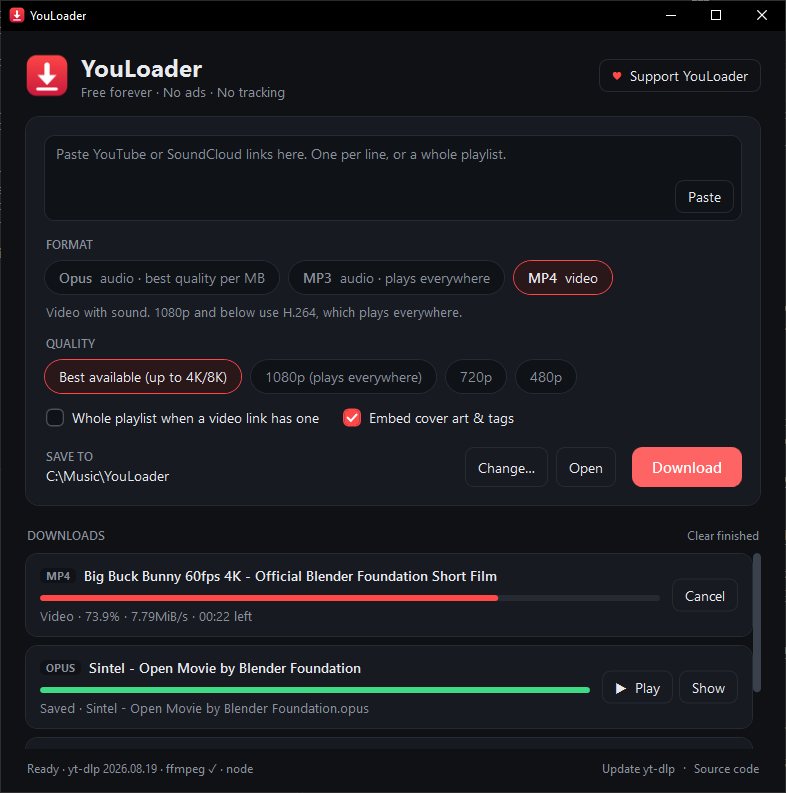

<div align="center">


# YouLoader

**Downloads. Nothing else.**

A free, open-source YouTube and SoundCloud downloader for Windows.<br>
Opus, MP3 and MP4, with no ads, no pop-ups, no sign-up and no tracking.

[](https://github.com/SmileyBoy321/YouLoader/releases/latest/download/YouLoader.exe)
[](https://github.com/SmileyBoy321/YouLoader/actions/workflows/ci.yml)
[](LICENSE)



</div>

## Why

Search for “YouTube to MP3” and you get sites full of pop-unders, fake download buttons and “allow notifications” traps. YouLoader is the opposite: a small app that runs on your own PC, does one job well, and asks for nothing in return.

It follows the example of [VLC](https://www.videolan.org/): **free forever, no ads, no tracking, open source.** If it's useful to you, you can [support it on Ko-fi](https://ko-fi.com/smileyboyy).

## Features

- **Opus, MP3 and MP4.** Opus is an exact copy of YouTube's audio stream with no re-encoding. MP3 goes up to 320 kbps. MP4 goes from 480p up to 4K and 8K.
- **Playlists, channels and SoundCloud sets** download into their own numbered folder. Paste the same link later and only new items are fetched.
- **Cover art and tags** are embedded automatically, with thumbnails cropped square for music players.
- **Several links at once**, two downloads in parallel, cancel and retry per item, and automatic retries when YouTube drops a connection.
- **Keeps working when YouTube changes.** YouLoader updates its download engine (yt-dlp) automatically once a day.
- **Portable.** One `.exe`, nothing to install.

## Download

Get **[YouLoader.exe](https://github.com/SmileyBoy321/YouLoader/releases/latest/download/YouLoader.exe)** from the [latest release](https://github.com/SmileyBoy321/YouLoader/releases/latest). It runs on Windows 10 and 11 (64-bit).

On first launch it downloads the official builds of [yt-dlp](https://github.com/yt-dlp/yt-dlp) and [ffmpeg](https://ffmpeg.org/), and [Deno](https://deno.com/) if no JavaScript runtime is installed. It keeps them in `%LocalAppData%\YouLoader\tools`.

> Windows may say *“Windows protected your PC”* because the app isn't code-signed yet. Click **More info → Run anyway**. Each release lists the file's SHA-256 checksum so you can verify it.

## Which format should I pick?

| | Opus | MP3 | MP4 |
|---|---|---|---|
| **What** | YouTube's own audio, copied | Converted audio | Video + audio |
| **4-minute song** | ≈ 4 MB | ≈ 9.6 MB (320 kbps) | depends on resolution |
| **Quality** | Identical to YouTube | Near-identical | Up to 4K/8K |
| **Plays on** | Android, PC, browsers, VLC | Everything | Everything at 1080p |

Pick **Opus** unless the music has to play on an iPhone, an old MP3 player or a car stereo.

## Building from source

Requires the [.NET 10 SDK](https://dotnet.microsoft.com/download) on Windows.

```powershell
git clone https://github.com/SmileyBoy321/YouLoader.git
cd YouLoader
dotnet run --project src/YouLoader                  # run it
dotnet test                                         # unit tests
$env:YOULOADER_INTEGRATION = "1"; dotnet test       # plus real downloads from YouTube
dotnet publish src/YouLoader -c Release -o dist     # portable dist/YouLoader.exe
```

| Folder | What's inside |
|---|---|
| `src/YouLoader.Core` | Everything testable: yt-dlp arguments, output parsing, tool management, the download queue model |
| `src/YouLoader` | The WPF window |
| `tests/YouLoader.Tests` | Unit tests, plus integration tests that run real downloads |
| `website` | The landing page: `python website/build.py` builds it into `website/public` |

## Releasing

Bump `<Version>` in `src/YouLoader/YouLoader.csproj`, commit, then tag and push:

```powershell
git tag v2.0.1
git push origin v2.0.1
```

GitHub Actions runs the tests, builds `YouLoader.exe` and publishes it with its checksum. The website's download button always points at the newest release.

## Please download responsibly

YouLoader is a tool, like a browser or a video recorder. Only download content you own, content that's openly licensed (such as Creative Commons or public domain), or content you have permission to download. Respect creators and each site's terms of service.

## License

[MIT](LICENSE). YouLoader relies on [yt-dlp](https://github.com/yt-dlp/yt-dlp) (Unlicense) and [ffmpeg](https://ffmpeg.org/) (GPL build), which it downloads separately at runtime.
